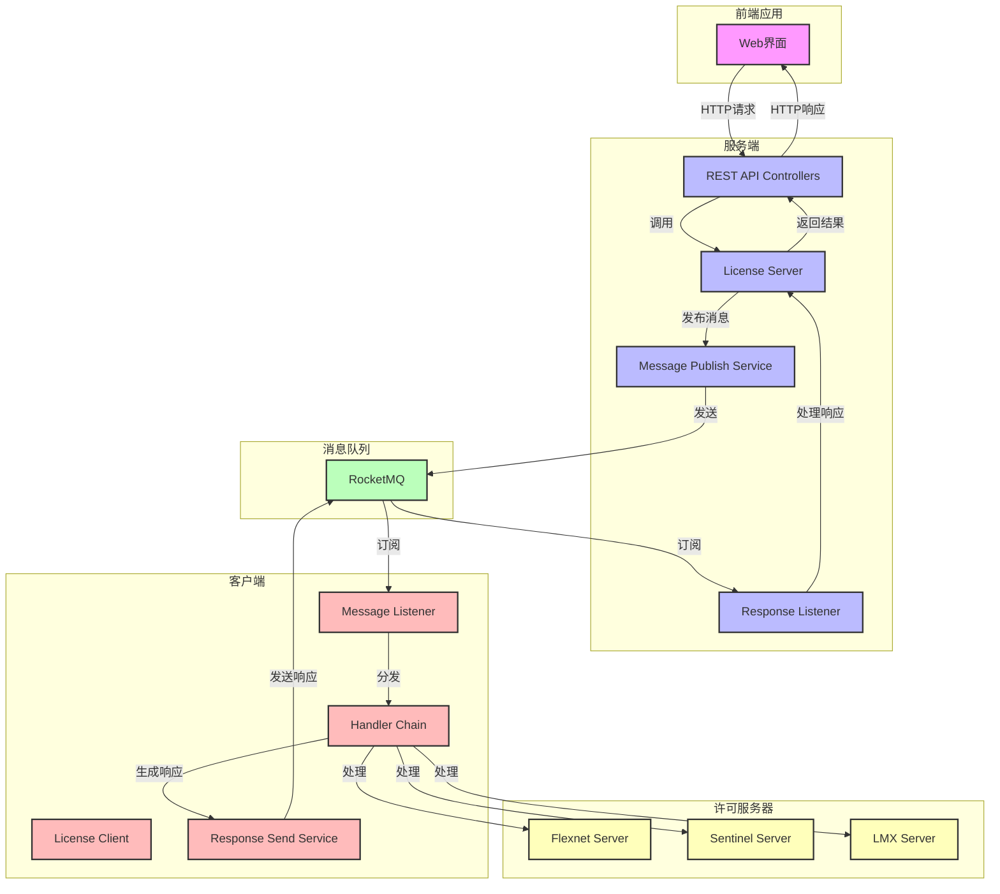

# 许可管理系统架构设计

## 系统架构图

## 系统模块说明

### 1. 服务端模块 (license-server)
- **LicenseMgmtController**：REST API接口，处理前端请求
- **LicenseMgmtService**：业务逻辑层，处理许可管理业务
- **MessagePublishService**：消息发布服务，负责发送消息到RocketMQ
- **ResponseMessageListener**：响应消息监听器，接收客户端的处理结果

### 2. 客户端模块 (license-client)
- **LicenseMessageListener**：消息监听器，接收服务端发送的消息
- **MessageHandler**：消息处理器接口，定义各类消息的处理逻辑
- **AbstractMessageHandler**：处理器抽象基类，提供通用处理逻辑
- **具体处理器**：
  - UserKickoutHandler：处理用户踢出操作
  - ServiceManageHandler：处理服务管理操作
  - WhitelistManageHandler：处理白名单管理操作
  - FileManageHandler：处理文件管理操作
  - MonitorUsageHandler：处理监控数据采集
- **ResponseSendService**：响应发送服务，将处理结果发送回服务端

### 3. 公共模块 (license-common)
- **LicenseMessage**：消息模型，定义消息结构
- **LicenseResponse**：响应模型，定义响应结构
- **枚举类**：SoftwareType, OperationType, MessageStatus
- **工具类**：BusinessKeyGenerator, TagBuilder
- **异常类**：LicenseException, MessagePublishException, MessageProcessException

## 核心功能

### 1. 浮动许可用户踢出
- 支持Flexnet、Sentinel、LMX三种类型
- 通过消息队列发送踢出命令
- 客户端执行踢出操作并返回结果

### 2. 许可服务管理
- 支持启动、重启、关闭操作
- 针对不同类型的许可服务器

### 3. 许可白名单管理
- 支持初始化、添加、删除、查询操作
- 管理不同类型软件的白名单

### 4. 许可文件及日志管理
- 支持查询、更新、下载操作
- 管理许可文件和日志文件

### 5. 许可使用情况监控
- 定期采集许可使用人数及人员信息
- 支持60个监控对象，每5分钟采集一次

## 消息流程

1. **消息发送**：服务端通过MessagePublishService将消息发送到RocketMQ
2. **消息路由**：客户端通过LicenseMessageListener接收消息，根据hostname字段进行过滤
3. **消息处理**：客户端使用对应的处理器处理消息
4. **响应返回**：客户端通过ResponseSendService将处理结果发送回服务端
5. **响应处理**：服务端通过ResponseMessageListener接收响应并返回给前端

## 技术栈

- **后端**：Java 17, Spring Boot 3.x, RocketMQ
- **前端**：Web界面（由前端团队实现）
- **消息队列**：RocketMQ
- **构建工具**：Maven

## 部署说明

1. **服务端部署**：
   - 部署在云端服务器
   - 配置RocketMQ连接信息
   - 启动LicenseServerApplication

2. **客户端部署**：
   - 部署在每个许可服务器上
   - 配置hostname为服务器实际主机名
   - 配置RocketMQ连接信息
   - 启动LicenseClientApplication

3. **RocketMQ部署**：
   - 部署RocketMQ集群
   - 确保服务端和客户端都能访问

## 安全性

- **消息路由**：严格的主机名匹配，只处理明确指定的消息
- **类型安全**：添加类型检查，避免运行时异常
- **错误处理**：完善的异常处理机制
- **消息验证**：验证消息格式和内容

## 可扩展性

- **模块化设计**：易于添加新的处理器和功能
- **插件架构**：支持不同类型的许可软件
- **水平扩展**：服务端和客户端都可以水平扩展
- **消息队列**：通过消息队列实现解耦，提高系统可靠性
